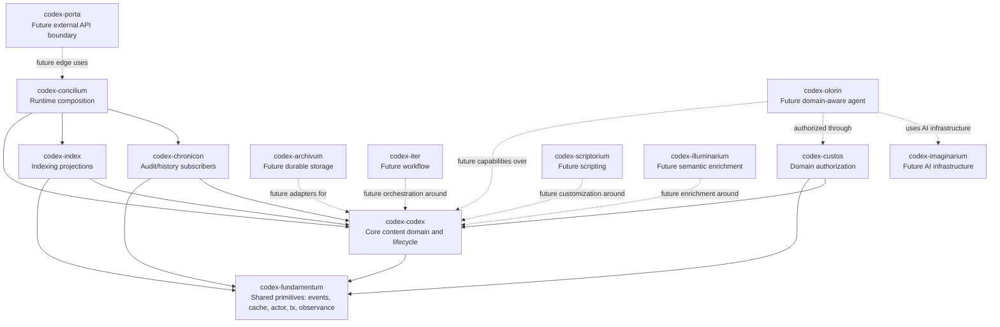
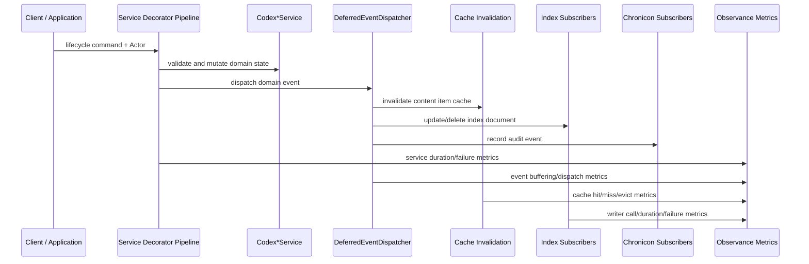
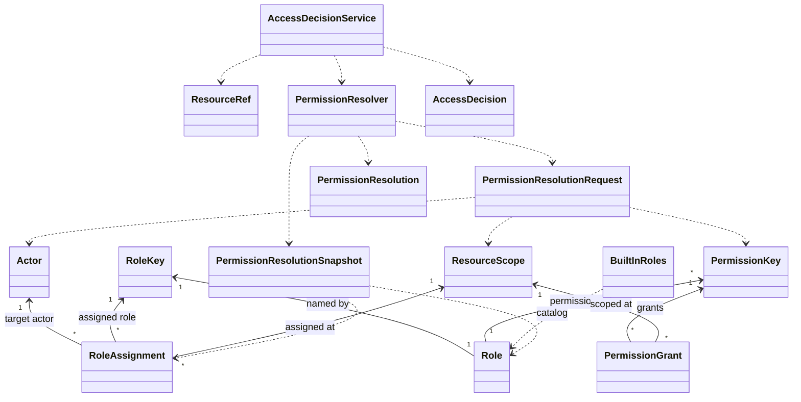
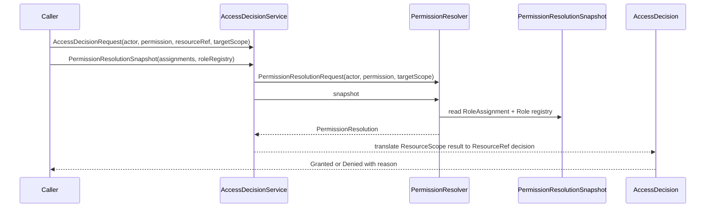
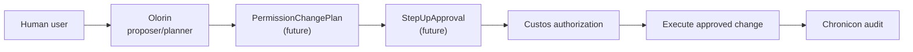

# Codex Blueprint

Codex is a headless, multi-tenant, multi-language CMS built as a disciplined
modular monolith. This blueprint describes the architecture as it exists today
and the direction it is deliberately moving toward.

It is a reader's map, not a task log and not a complete class reference.

## 1. What Codex Is

Codex is a domain-first content system.

The center of the system is not an HTTP endpoint, a database table, or a page
template. The center is the content domain:

- sites
- content types
- content type versions
- content items
- content revisions
- lifecycle operations
- domain events
- authorization over domain operations
- audit/history projections
- indexing projections

The repository is organized as a Maven/Jigsaw modular monolith. Modules expose
public APIs through `codex.<module>.api` packages and keep implementation detail
under `codex.<module>.internal`.

Codex currently has meaningful implementation in the core domain, event flow,
cache/index foundations, Chronicon audit subscribers, Observance instrumentation,
runtime composition, and Custos authorization primitives.

## 2. What Codex Is Not

Codex is not endpoint-first.

Authorization, lifecycle, cache invalidation, audit, and indexing are modeled
around domain operations and domain events, not around routes such as
`POST /content/{id}/publish`.

Codex is not page-centric first.

The first-class model is structured content and lifecycle. Pages can be built
on top of that later, but the core is not organized as a page tree.

Codex is not REST-first.

`codex-porta` is the future external boundary. The core does not depend on REST,
GraphQL, servlet APIs, Spring Security, JWT, SAML, OIDC, or HTTP concepts.

Codex is not persistence-first.

Current repositories are in-memory implementations for early development and
tests. Durable persistence is future `codex-archivum` work.

Codex is not an AI agent with database access.

The AI direction is split deliberately:

- `codex-imaginarium` is AI infrastructure.
- `codex-olorin` is the domain-aware agent/planner layer.

Olorin must operate through explicit capabilities and Custos authorization. It
must not bypass domain policies or execute privileged permission changes by its
own authority.

## 3. Design Principles

- Domain before endpoints.
- Explicit modules before framework magic.
- Public API and internal implementation are separate package surfaces.
- Decorators over hidden AOP.
- Events are domain signals: facts that already happened.
- Observance is first-class instrumentation, separate from audit and logs.
- Authorization evaluates domain operations, not HTTP routes.
- Agents operate through explicit capabilities and authorization gates.
- The core module must not depend on projection, adapter, or edge modules.
- Future infrastructure should attach at module/runtime boundaries, not leak
  into core entities.

## 4. Current Implementation Status

### Implemented / Advanced

- Maven/Jigsaw modular structure.
- `api` / `internal` package boundaries.
- Core content domain foundations:
  - `Site`
  - `ContentType`
  - `ContentTypeVersion`
  - `ContentItem`
  - `ContentRevision`
- Site, content type, and content item lifecycle services.
- Domain commands, identities, statuses, and lifecycle events.
- Event publishing decorators for core services.
- Deferred event dispatch with transaction-aware buffering.
- Content item cache invalidation subscribers.
- Cache observability through `ObservingCacheRegion`.
- Service timing decorators for site, content type, and content item services.
- Index runtime with content item published-only indexing and removal subscribers.
- `ObservingIndexWriter`.
- Chronicon audit model and lifecycle event subscribers.
- Concilium runtime composition for core + index + chronicon.
- Observance API and in-memory/no-op implementations.
- Custos Phase 0 primitives:
  - `PermissionKey`
  - `ResourceRef`
  - `ResourceScope`
  - `AccessDecision`
  - `AccessDeniedException`
  - `SecurityEvaluationContext`
  - `PermissionEvaluator`
  - `AccessDecisionService`
- Custos early Phase 1 primitives:
  - `Permissions`
  - `RoleKey`
  - `Role`
  - `PermissionGrant`
  - `RoleAssignment`
  - `BuiltInRoles`
  - `PermissionResolver`
  - `PermissionResolution`
  - `DefaultPermissionResolver`
  - `DefaultAccessDecisionService`

### In Progress

- Wiring Custos authorization into secured domain service decorators.
- Domain-specific permission services such as `SitePermissionsService`,
  `ContentTypePermissionsService`, and `ContentItemPermissionsService`.
- Direct actor `PermissionGrant` support.
- Explanation traces beyond the current reason strings.
- Fuller Observance coverage across repositories, transactions, and future adapters.
- Blueprint and architecture documentation.

### Deferred

- REST/GraphQL/API exposure through `codex-porta`.
- Durable persistence strategy through `codex-archivum`.
- Production authentication integration.
- Full workflow behavior through `codex-iter`.
- Step-up approval.
- Olorin permission proposal execution.
- UI/admin surface.
- Distributed cache/index/audit backends.
- Production search backend adapters.

## 5. Module Map



Arrows point toward the module being used. Directionally, `codex-codex` is the
canonical core. Projection and edge modules may depend inward on the core, but
the core must not depend on them. Runtime composition belongs in
`codex-concilium`.

Observance lives in `codex-fundamentum` as a shared abstraction and is wired
through the core runtime, event dispatchers, cache region, service decorators,
and index writer.

## 6. Core Domain Flow



Current content item lifecycle events drive cache invalidation, Chronicon audit
records, and published-only indexing behavior. Indexing currently upserts on
publish and removes on unpublish/archive/delete.

## 7. Service Decoration Model

Codex grows behavior through explicit decorators. The full direction looks like:

```mermaid
flowchart LR
    client["Client / Application Service"]
    secured["Secured*Service<br/>(future)"]
    timed["Timed / Observed Service<br/>(implemented for core services)"]
    transactional["Transactional boundary<br/>(future / runtime dependent)"]
    auditing["Auditing decorator<br/>(future where needed)"]
    events["EventPublishing*Service<br/>(implemented)"]
    caching["CachingContentItemService<br/>(implemented for content item reads)"]
    default["Default domain service<br/>(Codex*Service)"]

    client --> secured --> timed --> transactional --> auditing --> events --> caching --> default
```



Not every layer exists for every service today.

Current core runtime composition includes:

- `TimedSiteService -> EventPublishingSiteService -> CodexSiteService`
- `TimedContentTypeService -> EventPublishingContentTypeService -> CodexContentTypeService`
- `TimedContentItemService -> EventPublishingContentItemService -> CachingContentItemService -> CodexContentItemService`

Secured service decorators are future Custos integration work.

## 8. Custos Authorization Model

Custos is the domain authorization boundary. It answers:

```text
May this Actor perform this PermissionKey on this ResourceRef under this Context?
```

Core mental model:

- Grant / Assignment = authorization data.
- Resolver = computes effective permissions.
- Evaluator / `AccessDecisionService` = turns resolution into can/cannot.
- `AccessDecision` = explainable result for callers.



Important distinctions:

- `Role` is a blueprint. It does not contain an actor or scope.
- `RoleAssignment` pairs an `Actor` with a `RoleKey` at a `ResourceScope`.
- `PermissionGrant` pairs a `PermissionKey` with a `ResourceScope`. It does
  not carry an actor or role.
- `ResourceRef` is the concrete resource being evaluated.
- `ResourceScope` is the scope used for permission resolution.

## 9. Custos Authorization Flow



`AccessDecisionService` exists as a public API and `DefaultAccessDecisionService`
exists as a thin internal adapter over `PermissionResolver`. Domain-specific
permission services and secured decorators are still pending.

The difference between `ResourceRef` and `ResourceScope` must remain explicit:

- `ResourceRef` is what the caller is asking about.
- `ResourceScope` is where the resolver walks permission assignments.

Hiding this distinction behind magic would make authorization harder to explain.

## 10. SUPER_ADMIN and Agent Safety

`SUPER_ADMIN` is a normal `Role` blueprint in `BuiltInRoles`.

`BuiltInRoles.SUPER_ADMIN` includes all built-in permissions for introspection
and blueprint purposes. It does not encode bypass behavior by itself.

Bypass semantics live in resolver/evaluator behavior:

- hard invariants run first;
- an `AGENT` holding `SUPER_ADMIN` is a Custos invariant violation;
- that invariant violation is not a normal denied decision;
- valid non-agent actors may receive scoped `SUPER_ADMIN` bypass;
- scope walking must not cross site boundaries.

Olorin and other agent actors may propose permission changes, but they must not
execute privileged permission changes by their own authority.

## 11. AI Direction

Codex separates AI infrastructure from agent authority.

`codex-imaginarium` is the future AI infrastructure layer. It may provide model
integration, orchestration, retrieval helpers, and other AI-oriented building
blocks.

`codex-olorin` is the future domain-aware agent/planner layer. It should reason
over Codex concepts, propose safe plans, and operate through explicit
capabilities.

The intended permission flow for agent-assisted security changes is:



Future work includes `PermissionChangePlan`, `StepUpApproval`, audit integration
for applied permission changes, and explicit capability boundaries for agent
actions.

## 12. Reading Path

Recommended path for new contributors:

1. `README.md`
2. `docs/CODEX-BLUEPRINT.md`
3. `docs/security/CUSTOS-MODEL.md`
4. `docs/security/CUSTOS-IMPLEMENTATION-CHECKLIST.md`
5. `docs/architecture/LIFECYCLE-VOCABULARY.md`
6. `docs/future-forward/ADR-009.md`
7. `docs/ADR-corpus/ADR-011.md`
8. module-specific README and docs

## 13. Current Boundaries to Remember

- `codex-codex` does not depend on `codex-index`, `codex-chronicon`, or
  `codex-custos`.
- `codex-concilium` composes runtimes; it does not own domain behavior.
- Chronicon audit is product/domain history, not operational metrics.
- Observance metrics are operational signals, not audit records.
- Index projections are derived views, not canonical content state.
- Custos authorizes domain operations, not HTTP endpoints.
- Olorin is an assistant/planner, not a security authority.

## 14. Future Direction Without Overclaiming

The architecture is moving toward:

- secured service decorators driven by Custos;
- domain-specific permission services;
- durable repositories in Archivum;
- external APIs in Porta;
- workflow orchestration in Iter;
- richer audit and permission-change history in Chronicon;
- production search adapters behind `IndexWriter`;
- agent proposal flows constrained by Custos and audit;
- broader Observance coverage at runtime boundaries.

Those are directions, not completed features.
