# Design — Intent 1: Narrow Custos Design

Status: Draft
Operating Role: Product Architect / Software Designer
Scope: Custos C1 — Complete Secured Mutation Enforcement

## 1. Purpose

Produce the narrow technical design that carries Intent 1 into implementation. The design fills three known authorization gaps by extending the existing Custos pattern; it deliberately introduces no new architecture. The primary artefacts are a CURRENT class diagram, a TARGET class diagram, and a bounded delta description between them.

The three operations in scope:

- `SiteService.unarchive`
- `ContentItemService.delete`
- `ContentItemService.restore`

Today each is a fail-closed `UnsupportedOperationException` inside the secured decorators. After this design each participates in the same authorization chain that already governs archive, publish, unpublish, update, and start/suspend.

Sources consulted:

- `docs/engineering/agents/tasks/intent1/intent.md`
- `docs/knowledge/use-cases/intent1/use-case-01-site-unarchive.md`, `use-case-02-content-item-delete.md`, `use-case-03-content-item-restore.md`
- `docs/knowledge/test-cases/intent1/TC-01` through `TC-17`
- `docs/engineering/plan/intent1/engineering-plan.md` (including MD-C1-01 acceptance)
- `docs/engineering/agents/reviews/intent1/Intent1PreImplementationReview.md`
- `docs/engineering/agents/reviews/intent1/Intent1PreImplementationReReview.md` — Verdict: PASS WITH MINOR CHANGES → Proceed to Design.
- `docs/knowledge/security/CUSTOS-MODEL.md`
- Repository code under `codex-custos/src/main/java/codex/custos/` — authoritative for the CURRENT diagram.

## 2. Accepted Decisions (Not Reopened)

- **Vocabulary**: `site.unarchive`, `contentItem.delete`, `contentItem.restore` are distinct permission keys.
- **No new implication rules**.
- **MD-C1-01 — Built-In Role Mapping**:

  | Permission | SUPER_ADMIN | SITE_ADMIN | EDITOR | COPYWRITER | REVIEWER | VIEWER |
  |---|---|---|---|---|---|---|
  | `site.unarchive` | Yes | Yes | No | No | No | No |
  | `contentItem.delete` | Yes | Yes | No | No | No | No |
  | `contentItem.restore` | Yes | Yes | Yes | No | No | No |
- **Scope walks** unchanged: Site → Global for site-scoped operations; ContentItem → ContentType → Site → Global for content-item-scoped operations.
- **Ordering**: secured decorator → authorization → `requireGranted()` → delegate → domain state-machine validation. Custos remains state-blind.
- **Hard invariant**: AGENT + SUPER_ADMIN stays fatal; never converted to a `Denied`.
- **Denied side-effect safety**: denials never reach the delegate; no domain mutation, event, projection update, or Chronicon audit.

## 3. Current-State Analysis

### 3.1 Reference chain used by every already-authorized mutation

Taking `ContentItemService.archive` as the reference:

```
SecuredContentItemService.archive
  1. null-guard inputs
  2. permissionsService.canArchiveContentItem(actor, siteKey, contentTypeKey, itemKey, snapshotProvider.get())
       → DefaultContentItemPermissionsService builds AccessDecisionRequest
           (permission = Permissions.CONTENT_ITEM_ARCHIVE,
            resourceRef = ContentItemResourceRef,
            targetScope = ContentItemScope)
       → AccessDecisionService.evaluate(request, snapshot)
       → DefaultAccessDecisionService delegates to PermissionResolver
       → DefaultPermissionResolver walks DefaultResourceScopeHierarchy bottom-up,
         checks role assignments against DefaultPermissionImplicationRules,
         returns PermissionResolution → mapped to AccessDecision
  3. decision.requireGranted()   // throws AccessDeniedException on Denied
  4. delegate.archive(command, actor)   // domain state machine enforces valid-transition rules
```

The identical shape is used by `create`, `findByKey`, `update`, `publish`, `unpublish`, and (for `SecuredSiteService`) `start`, `suspend`, `archive`.

### 3.2 The three gaps

| Location | Current code | Effect |
|---|---|---|
| `SecuredSiteService.unarchive` (lines 120–123) | `throw new UnsupportedOperationException("Secured unarchive is not supported until site unarchive permission semantics are defined")` | Fail-closed. Delegate never reached. Not an `AccessDeniedException`. |
| `SecuredContentItemService.delete` (lines 156–162) | Null-guards, then throws `UnsupportedOperationException("... content item delete permission semantics are defined")` | Fail-closed. Delegate never reached. |
| `SecuredContentItemService.restore` (lines 164–171) | Null-guards, then throws `UnsupportedOperationException("... content item restore permission semantics are defined")` | Fail-closed. Delegate never reached. |

The gap is uniformly narrow: three secured-decorator methods; three missing permission keys; three missing `can*` methods on the two permission-service interfaces. Every other layer in the chain — resolver, decision service, hierarchy, implication rules, runtime composition — is already correct and needs no change.

### 3.3 Repository facts anchoring the CURRENT diagram

- `codex.custos.api.model.Permissions` — 20 constants; no `SITE_UNARCHIVE`, `CONTENT_ITEM_DELETE`, `CONTENT_ITEM_RESTORE`.
- `codex.custos.api.model.BuiltInRoles` — six roles (`SUPER_ADMIN`, `SITE_ADMIN`, `EDITOR`, `COPYWRITER`, `REVIEWER`, `VIEWER`). None hold the three new permissions (they do not exist).
- `codex.custos.api.service.SitePermissionsService` — 5 methods; JavaDoc explicitly flags `site.update` and `site.delete` as absent. `canUnarchiveSite` is absent.
- `codex.custos.internal.service.DefaultSitePermissionsService` — one method per interface method, all delegating to `AccessDecisionService.evaluate(...)`.
- `codex.custos.api.service.ContentItemPermissionsService` — 6 methods; JavaDoc flags `contentItem.delete` as absent. `canDeleteContentItem` and `canRestoreContentItem` are absent.
- `codex.custos.internal.service.DefaultContentItemPermissionsService` — one method per interface method, uniform delegation.
- `codex.custos.internal.service.SecuredSiteService` — 8 methods; 5 authorized (`create`, `findByKey`, `start`, `suspend`, `archive`), 1 fail-closed (`unarchive`), 2 pass-through (`findByAlias`, `findAll`).
- `codex.custos.internal.service.SecuredContentItemService` — 10 methods; 6 authorized (`create`, `findByKey`, `update`, `publish`, `unpublish`, `archive`), 2 fail-closed (`delete`, `restore`), 2 pass-through (`findByContentType`, `findAll`).
- `codex.custos.api.service.SecuredServiceComposer` — factory that returns `SecuredSiteService`, `SecuredContentTypeService`, `SecuredContentItemService` wired by interface.
- `codex.concilium.api.runtime.ConciliumRuntime.secured(snapshotProvider)` — composes the secured decorators; wires them by interface, never by method.

## 4. CURRENT Class Diagram

Focused on the C1 authorization path. Only methods that make the gap visible are shown.

```mermaid
classDiagram
    direction LR

    class Permissions {
      +SITE_READ
      +SITE_CREATE
      +SITE_START
      +SITE_SUSPEND
      +SITE_ARCHIVE
      +CONTENT_ITEM_READ
      +CONTENT_ITEM_CREATE
      +CONTENT_ITEM_UPDATE
      +CONTENT_ITEM_PUBLISH
      +CONTENT_ITEM_UNPUBLISH
      +CONTENT_ITEM_ARCHIVE
    }
    note for Permissions "No SITE_UNARCHIVE, CONTENT_ITEM_DELETE, CONTENT_ITEM_RESTORE"

    class BuiltInRoles {
      +SUPER_ADMIN
      +SITE_ADMIN
      +EDITOR
      +COPYWRITER
      +REVIEWER
      +VIEWER
    }
    note for BuiltInRoles "No role holds any of the three missing permissions"

    class SitePermissionsService {
      <<interface>>
      +canCreateSite(actor, snapshot) AccessDecision
      +canReadSite(actor, siteKey, snapshot) AccessDecision
      +canStartSite(actor, siteKey, snapshot) AccessDecision
      +canSuspendSite(actor, siteKey, snapshot) AccessDecision
      +canArchiveSite(actor, siteKey, snapshot) AccessDecision
    }
    note for SitePermissionsService "No canUnarchiveSite"

    class DefaultSitePermissionsService {
      -AccessDecisionService decisionService
    }

    class ContentItemPermissionsService {
      <<interface>>
      +canCreateContentItem(...) AccessDecision
      +canReadContentItem(...) AccessDecision
      +canUpdateContentItem(...) AccessDecision
      +canPublishContentItem(...) AccessDecision
      +canUnpublishContentItem(...) AccessDecision
      +canArchiveContentItem(...) AccessDecision
    }
    note for ContentItemPermissionsService "No canDeleteContentItem, canRestoreContentItem"

    class DefaultContentItemPermissionsService {
      -AccessDecisionService decisionService
    }

    class AccessDecisionService {
      <<interface>>
      +evaluate(request, snapshot) AccessDecision
    }

    class DefaultAccessDecisionService {
      -PermissionResolver resolver
    }

    class PermissionResolver {
      <<interface>>
      +resolve(request, snapshot) PermissionResolution
    }

    class DefaultPermissionResolver {
      -ResourceScopeHierarchy hierarchy
      -PermissionImplicationRules implications
    }

    class DefaultResourceScopeHierarchy
    class DefaultPermissionImplicationRules {
      +update ⇒ read
      +publish ⇒ read
    }

    class SecuredSiteService {
      -SiteService delegate
      -SitePermissionsService permissionsService
      -Supplier~PermissionResolutionSnapshot~ snapshotProvider
      +create(cmd, actor) : authorized
      +findByKey(...) : authorized
      +start(...) : authorized
      +suspend(...) : authorized
      +archive(...) : authorized
      +unarchive(cmd, actor) : UOE fail-closed
      +findByAlias(...) : pass-through
      +findAll(actor) : pass-through
    }

    class SecuredContentItemService {
      -ContentItemService delegate
      -ContentItemPermissionsService permissionsService
      -Supplier~PermissionResolutionSnapshot~ snapshotProvider
      +create(cmd, actor) : authorized
      +findByKey(...) : authorized
      +update(...) : authorized
      +publish(...) : authorized
      +unpublish(...) : authorized
      +archive(...) : authorized
      +delete(cmd, actor) : UOE fail-closed
      +restore(cmd, actor) : UOE fail-closed
      +findByContentType(...) : pass-through
      +findAll(actor) : pass-through
    }

    class SecuredServiceComposer {
      <<factory>>
      +wrapSiteService(delegate, perms, snapshot) SiteService
      +wrapContentItemService(delegate, perms, snapshot) ContentItemService
      +defaultSitePermissionsService(decision) SitePermissionsService
      +defaultContentItemPermissionsService(decision) ContentItemPermissionsService
      +defaultAccessDecisionService() AccessDecisionService
    }

    class ConciliumRuntime {
      +inMemory() : unsecured composition
      +secured(snapshotProvider) : composes secured decorators
    }

    SitePermissionsService <|.. DefaultSitePermissionsService
    ContentItemPermissionsService <|.. DefaultContentItemPermissionsService
    AccessDecisionService <|.. DefaultAccessDecisionService
    PermissionResolver <|.. DefaultPermissionResolver

    DefaultSitePermissionsService --> AccessDecisionService : delegates
    DefaultContentItemPermissionsService --> AccessDecisionService : delegates
    DefaultAccessDecisionService --> PermissionResolver : delegates
    DefaultPermissionResolver --> DefaultResourceScopeHierarchy
    DefaultPermissionResolver --> DefaultPermissionImplicationRules

    SecuredSiteService --> SitePermissionsService : uses
    SecuredContentItemService --> ContentItemPermissionsService : uses

    BuiltInRoles --> Permissions : references keys
    DefaultSitePermissionsService --> Permissions : references keys
    DefaultContentItemPermissionsService --> Permissions : references keys

    SecuredServiceComposer ..> SecuredSiteService : constructs
    SecuredServiceComposer ..> SecuredContentItemService : constructs
    SecuredServiceComposer ..> DefaultSitePermissionsService : constructs
    SecuredServiceComposer ..> DefaultContentItemPermissionsService : constructs
    SecuredServiceComposer ..> DefaultAccessDecisionService : constructs

    ConciliumRuntime ..> SecuredServiceComposer : uses in secured(...)
```



Three UOE fail-closed methods are visible on the secured decorators; the surrounding chain is complete.

## 5. TARGET Class Diagram

Same architecture. Additions marked `+`. Structural shape is unchanged.

```mermaid
classDiagram
    direction LR

    class Permissions {
      +SITE_READ
      +SITE_CREATE
      +SITE_START
      +SITE_SUSPEND
      +SITE_ARCHIVE
      +SITE_UNARCHIVE       [NEW]
      +CONTENT_ITEM_READ
      +CONTENT_ITEM_CREATE
      +CONTENT_ITEM_UPDATE
      +CONTENT_ITEM_PUBLISH
      +CONTENT_ITEM_UNPUBLISH
      +CONTENT_ITEM_ARCHIVE
      +CONTENT_ITEM_DELETE  [NEW]
      +CONTENT_ITEM_RESTORE [NEW]
    }

    class BuiltInRoles {
      +SUPER_ADMIN   : + site.unarchive, + contentItem.delete, + contentItem.restore
      +SITE_ADMIN    : + site.unarchive, + contentItem.delete, + contentItem.restore
      +EDITOR        : + contentItem.restore
      +COPYWRITER    : unchanged
      +REVIEWER      : unchanged
      +VIEWER        : unchanged
    }

    class SitePermissionsService {
      <<interface>>
      +canCreateSite(...)
      +canReadSite(...)
      +canStartSite(...)
      +canSuspendSite(...)
      +canArchiveSite(...)
      +canUnarchiveSite(actor, siteKey, snapshot) AccessDecision   [NEW]
    }

    class DefaultSitePermissionsService {
      -AccessDecisionService decisionService
      +canUnarchiveSite(...) : builds AccessDecisionRequest(SITE_UNARCHIVE, SiteResourceRef, SiteScope) → evaluate   [NEW]
    }

    class ContentItemPermissionsService {
      <<interface>>
      +canCreateContentItem(...)
      +canReadContentItem(...)
      +canUpdateContentItem(...)
      +canPublishContentItem(...)
      +canUnpublishContentItem(...)
      +canArchiveContentItem(...)
      +canDeleteContentItem(actor, siteKey, ctypeKey, itemKey, snapshot) AccessDecision   [NEW]
      +canRestoreContentItem(actor, siteKey, ctypeKey, itemKey, snapshot) AccessDecision  [NEW]
    }

    class DefaultContentItemPermissionsService {
      -AccessDecisionService decisionService
      +canDeleteContentItem(...) : builds AccessDecisionRequest(CONTENT_ITEM_DELETE, ContentItemResourceRef, ContentItemScope) → evaluate   [NEW]
      +canRestoreContentItem(...) : builds AccessDecisionRequest(CONTENT_ITEM_RESTORE, ContentItemResourceRef, ContentItemScope) → evaluate [NEW]
    }

    class AccessDecisionService {
      <<interface>>
      +evaluate(request, snapshot) AccessDecision
    }

    class DefaultAccessDecisionService
    class PermissionResolver {
      <<interface>>
    }
    class DefaultPermissionResolver
    class DefaultResourceScopeHierarchy
    class DefaultPermissionImplicationRules {
      +update ⇒ read
      +publish ⇒ read
      [no changes]
    }

    class SecuredSiteService {
      +create(...) : authorized
      +findByKey(...) : authorized
      +start(...) : authorized
      +suspend(...) : authorized
      +archive(...) : authorized
      +unarchive(cmd, actor) : authorized   [CHANGED — no longer UOE]
      +findByAlias(...) : pass-through
      +findAll(actor) : pass-through
    }

    class SecuredContentItemService {
      +create(...) : authorized
      +findByKey(...) : authorized
      +update(...) : authorized
      +publish(...) : authorized
      +unpublish(...) : authorized
      +archive(...) : authorized
      +delete(cmd, actor) : authorized   [CHANGED — no longer UOE]
      +restore(cmd, actor) : authorized  [CHANGED — no longer UOE]
      +findByContentType(...) : pass-through
      +findAll(actor) : pass-through
    }

    class SecuredServiceComposer {
      <<factory>>
      [unchanged]
    }
    class ConciliumRuntime {
      +inMemory()
      +secured(snapshotProvider)
      [unchanged]
    }

    SitePermissionsService <|.. DefaultSitePermissionsService
    ContentItemPermissionsService <|.. DefaultContentItemPermissionsService
    AccessDecisionService <|.. DefaultAccessDecisionService
    PermissionResolver <|.. DefaultPermissionResolver

    DefaultSitePermissionsService --> AccessDecisionService : delegates
    DefaultContentItemPermissionsService --> AccessDecisionService : delegates
    DefaultAccessDecisionService --> PermissionResolver : delegates
    DefaultPermissionResolver --> DefaultResourceScopeHierarchy
    DefaultPermissionResolver --> DefaultPermissionImplicationRules

    SecuredSiteService --> SitePermissionsService : uses (unarchive now included)
    SecuredContentItemService --> ContentItemPermissionsService : uses (delete/restore now included)

    BuiltInRoles --> Permissions : references keys (three new)
    DefaultSitePermissionsService --> Permissions : references SITE_UNARCHIVE
    DefaultContentItemPermissionsService --> Permissions : references CONTENT_ITEM_DELETE, CONTENT_ITEM_RESTORE

    SecuredServiceComposer ..> SecuredSiteService : constructs
    SecuredServiceComposer ..> SecuredContentItemService : constructs
    ConciliumRuntime ..> SecuredServiceComposer : uses in secured(...)
```



The diagram is identical in topology to CURRENT. Only interface method sets, blueprint permission sets, and the three secured-decorator method bodies change.

## 6. Delta Summary

Concise enumeration of everything the design changes and everything it deliberately does not.

**Changes**

- `Permissions`: add three constants — `SITE_UNARCHIVE`, `CONTENT_ITEM_DELETE`, `CONTENT_ITEM_RESTORE`.
- `BuiltInRoles`: extend `SUPER_ADMIN`, `SITE_ADMIN`, and `EDITOR` blueprints per MD-C1-01.
- `SitePermissionsService`: add `canUnarchiveSite`.
- `DefaultSitePermissionsService`: implement `canUnarchiveSite` in the pattern of `canArchiveSite`.
- `ContentItemPermissionsService`: add `canDeleteContentItem`, `canRestoreContentItem`.
- `DefaultContentItemPermissionsService`: implement both in the pattern of `canArchiveContentItem`.
- `SecuredSiteService.unarchive`: replace UOE with the standard authorized-mutation body.
- `SecuredContentItemService.delete`, `.restore`: replace UOE with the standard authorized-mutation body.
- `SitePermissionsService` and `ContentItemPermissionsService` JavaDoc: remove the "absent from this service …" notes.

**Deliberately not changed**

- `AccessDecisionService` / `DefaultAccessDecisionService`.
- `PermissionResolver` / `DefaultPermissionResolver`.
- `DefaultResourceScopeHierarchy`.
- `DefaultPermissionImplicationRules` (no new implications).
- `AccessDecisionRequest`, `PermissionResolutionRequest`, `PermissionResolutionSnapshot`, `AccessDecision` / `PermissionResolution` sealed hierarchies.
- `ResourceRef` / `ResourceScope` hierarchies.
- `SecuredServiceComposer` factory contract or wiring.
- `ConciliumRuntime.secured(...)` composition or ordering.
- Any Codex core service (`SiteService`, `ContentItemService`) — the domain lifecycle is untouched.
- Any Chronicon, Observance, projection, or event type.
- Module boundaries or JPMS `module-info.java` exports/requires.

## 7. Public Contract Impact

- **New public constants** on `codex.custos.api.model.Permissions`: `SITE_UNARCHIVE`, `CONTENT_ITEM_DELETE`, `CONTENT_ITEM_RESTORE`. Additive.
- **New interface methods**:
  - `SitePermissionsService.canUnarchiveSite(Actor, SiteKey, PermissionResolutionSnapshot) : AccessDecision`
  - `ContentItemPermissionsService.canDeleteContentItem(Actor, SiteKey, ContentTypeKey, ContentItemKey, PermissionResolutionSnapshot) : AccessDecision`
  - `ContentItemPermissionsService.canRestoreContentItem(Actor, SiteKey, ContentTypeKey, ContentItemKey, PermissionResolutionSnapshot) : AccessDecision`

  All three follow the exact argument shape of the neighbouring `canArchive*` method. No `default` method body is added — the interfaces stay strict.
- **No changes to existing method signatures.**
- **No changes to record shapes** for `AccessDecisionRequest`, `AccessDecision`, `PermissionResolutionSnapshot`, or `RoleAssignment`.
- **`BuiltInRoles`** enumerates additional permission keys on three of six roles per MD-C1-01. Since the role blueprint is exposed as `Role` (a record with a `Set<PermissionKey>`), the change is data-only.
- **JavaDoc drift removal**: the "Absent from this service …" notes on `SitePermissionsService` and `ContentItemPermissionsService` are removed once the corresponding methods exist.

## 8. Internal Implementation Impact

Every change reuses an existing template.

- `DefaultSitePermissionsService.canUnarchiveSite`: mirror `canArchiveSite`.
  - Null-guard inputs.
  - Log at DEBUG.
  - Build `AccessDecisionRequest(actor, Permissions.SITE_UNARCHIVE, new SiteResourceRef(siteKey), new SiteScope(siteKey))`.
  - Return `decisionService.evaluate(request, snapshot)`.
- `DefaultContentItemPermissionsService.canDeleteContentItem` and `.canRestoreContentItem`: mirror `canArchiveContentItem`.
  - Null-guard inputs.
  - Log at DEBUG.
  - Build `AccessDecisionRequest` with the appropriate `Permissions` constant, `ContentItemResourceRef(...)`, and `ContentItemScope(...)`.
  - Return `decisionService.evaluate(request, snapshot)`.
- `SecuredSiteService.unarchive`: mirror `SecuredSiteService.archive`.
  - Null-guard `command` and `actor`.
  - `AccessDecision decision = permissionsService.canUnarchiveSite(actor, command.siteKey(), snapshotProvider.get());`
  - `decision.requireGranted();`
  - `return delegate.unarchive(command, actor);`
- `SecuredContentItemService.delete`: mirror `SecuredContentItemService.archive`.
  - Same shape, using `canDeleteContentItem` and the command's identifiers.
  - Void return preserved.
- `SecuredContentItemService.restore`: mirror `SecuredContentItemService.archive`.
  - Same shape, using `canRestoreContentItem`.
  - `ContentItem` return preserved.

No new fields, no new constructors, no new collaborators. `snapshotProvider.get()` is invoked exactly once per call, consistent with the surrounding methods.

## 9. Resource and Scope Mapping

Each new permission constructs the same `ResourceRef` and `ResourceScope` shape used by the corresponding archive-family permission. The scope walk in `DefaultResourceScopeHierarchy` handles the rest without change.

| Operation | Permission key | `ResourceRef` | `ResourceScope` (target) | Effective walk (finest → broadest) |
|---|---|---|---|---|
| Site unarchive | `SITE_UNARCHIVE` | `SiteResourceRef(siteKey)` | `SiteScope(siteKey)` | `SiteScope` → `GlobalScope` |
| ContentItem delete | `CONTENT_ITEM_DELETE` | `ContentItemResourceRef(siteKey, contentTypeKey, itemKey)` | `ContentItemScope(...)` | `ContentItemScope` → `ContentTypeScope` → `SiteScope` → `GlobalScope` |
| ContentItem restore | `CONTENT_ITEM_RESTORE` | `ContentItemResourceRef(...)` | `ContentItemScope(...)` | `ContentItemScope` → `ContentTypeScope` → `SiteScope` → `GlobalScope` |

Cross-Site isolation is inherited: the hierarchy never crosses `SiteKey` boundaries, and each `ResourceRef`/`ResourceScope` carries the target `SiteKey` explicitly.

## 10. Failure Semantics

Three distinct outcomes; the design does not introduce a fourth.

1. **Denied**
   - `AccessDecisionService.evaluate` returns `AccessDecision.Denied`.
   - `decision.requireGranted()` throws `AccessDeniedException`.
   - `delegate.<operation>(...)` is not invoked.
   - No domain mutation, event, projection update, or Chronicon audit is produced.
2. **Hard invariant violation** (e.g. AGENT actor holds `SUPER_ADMIN`)
   - `DefaultPermissionResolver` (or upstream evaluation) raises `CustosAgentSuperAdminInvariantViolationException`.
   - The exception propagates through the secured decorator unchanged.
   - It is never converted into a `Denied` or into any other exception type.
   - Delegate is not invoked.
3. **Granted but invalid domain state**
   - `decision.requireGranted()` returns normally.
   - `delegate.<operation>(...)` is invoked.
   - The domain state machine rejects the transition (e.g. `delete` on a non-`ARCHIVED` item) and raises its own domain exception.
   - The domain error is not a Custos denial and does not degrade into one.

## 11. Runtime / Module Impact

- **`SecuredServiceComposer`**: no structural change. Factory methods return the same decorator types wired by the same constructor arguments; adding methods inside those types is invisible to the composer.
- **`ConciliumRuntime.secured(snapshotProvider)`**: no structural change. Composition wires services by interface (`SiteService`, `ContentItemService`); interface-method additions are transparent to the runtime assembly.
- **`ConciliumRuntime.inMemory()`**: unchanged; unsecured path continues to bypass Custos, preserving current test back-compat.
- **JPMS**:
  - `module-info.java` for `codex.custos` already exports `codex.custos.api.model` and `codex.custos.api.service`. New constants and new interface methods live in existing exported packages; no export list changes.
  - No `requires` changes; no `requires transitive` changes; no qualified export changes.
- **Module topology**: unchanged. `codex-concilium` continues to depend on `codex-custos` via the same public API; no new module boundaries or cross-module coupling.

## 12. Test Seams

Reused, not redesigned. The engineering plan (§7 of `engineering-plan.md`) allocates each responsibility to exactly one primary layer; the design honours that mapping.

| Seam | Location | Verifies | Covered test cases |
|---|---|---|---|
| Permission-service unit | `DefaultSitePermissionsServiceTest`, `DefaultContentItemPermissionsServiceTest` | Each new `can*` method: null guards; builds correct `AccessDecisionRequest` (key, ref, scope); returns whatever `AccessDecisionService` returns. | TC-01/02, TC-05/06, TC-10/11 partial coverage |
| Secured-decorator seam | `SecuredSiteServiceTest`, `SecuredContentItemServiceTest` | Null guards; permissions service invoked once; snapshot provider invoked once; denied → `AccessDeniedException` + delegate untouched; granted → delegate invoked once, return preserved; no UOE remains. | TC-02, TC-06, TC-11, TC-17 |
| Built-in-role blueprint | `BuiltInRolesTest` (extended) | Exact permission set per role matches MD-C1-01; no unmodified role gains a new permission. | TC-01, TC-05, TC-10 (grant side) |
| Authorization matrix | `SecuredContentItemServiceAuthorizationMatrixTest` (extended); new `SecuredSiteServiceAuthorizationMatrixTest` if absent | Role × permission × scope through the real chain; cross-Site isolation; AGENT+SUPER_ADMIN invariant; restore ⇏ publish. | TC-03, TC-04, TC-08, TC-09, TC-13, TC-14, TC-15 |
| Concilium denied-side-effect runtime | Existing runtime integration tests (extended) | For each of the three operations: denied call yields `AccessDeniedException` with no domain event, projection update, or Chronicon audit. Granted call on invalid domain state surfaces a domain error, not a Custos denial. | TC-07, TC-12, TC-16 |

Each responsibility is asserted at exactly one primary layer to avoid the redundant-assertion drift flagged in the pre-implementation review.

## 13. Explicit Non-Goals

This design does not address, and no diagram element implies:

- ContentItem archive semantics, delete storage semantics, tombstones, recycle bin, retention periods, physical purge, historical persistence after deletion, revision retention.
- Cache eviction architecture beyond the event flow already in place.
- New domain events, Chronicon semantics, persistence, or projection design.
- Authorization decision records, Observance authorization metrics, Aegis / security audit routing.
- Role administration, direct actor grants, permission grant/revoke UX, workflow.
- Collection-read filtering, alias-to-`SiteKey` authorization, list authorization.
- Porta / REST / API behaviour, Olorin / AI authorization.
- New authorization pipelines, strategy/factory hierarchies, generic lifecycle-permission abstractions, new dispatcher layers, new resource models, new implication mechanisms.

Each non-goal is deferred to a subsequent Custos objective and is preserved by the roadmap.

## 14. Implementation-Readiness Conclusion

> **Intent 1 requires no new authorization architecture. The target state is a pattern-conforming extension of the existing Custos design.**

Repository evidence supports this conclusion: every layer surrounding the three fail-closed methods already provides the exact primitives needed — `Permissions` for keys, `BuiltInRoles` for blueprints, `SitePermissionsService` / `ContentItemPermissionsService` for domain-shaped authorization queries, `AccessDecisionService` → `PermissionResolver` → `DefaultResourceScopeHierarchy` → `DefaultPermissionImplicationRules` for the evaluation chain, and `SecuredServiceComposer` / `ConciliumRuntime.secured` for composition. Each C1 operation slots into that chain with the same shape as its archive-family neighbour.

No speculative abstraction is introduced. The engineering plan's seven slices remain executable without modification.
