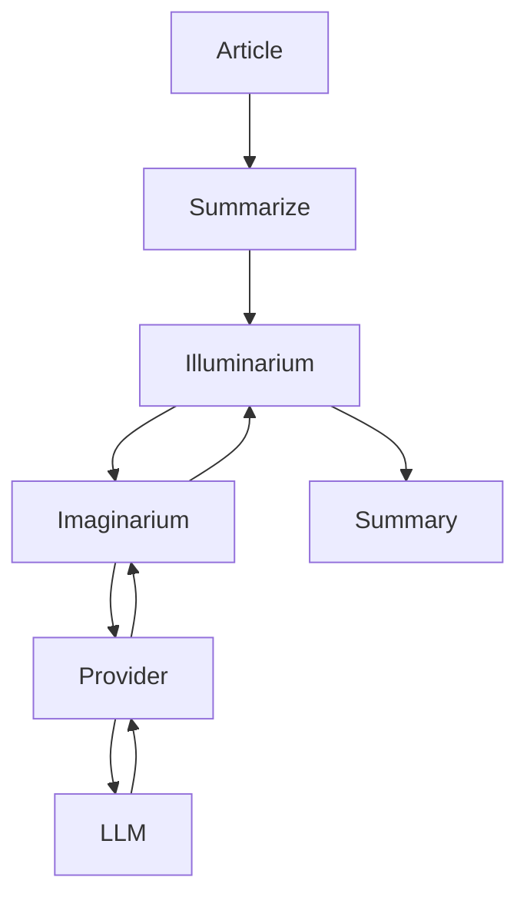
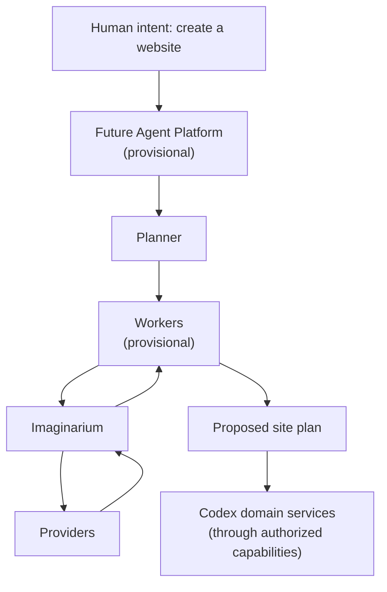
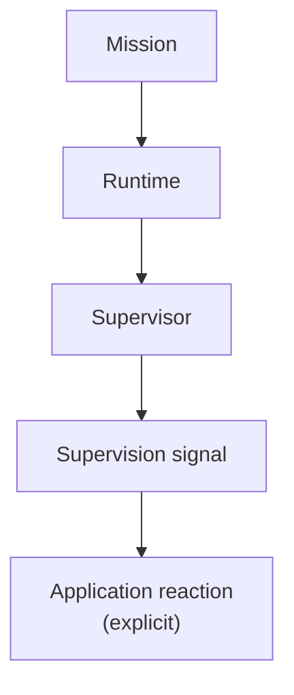
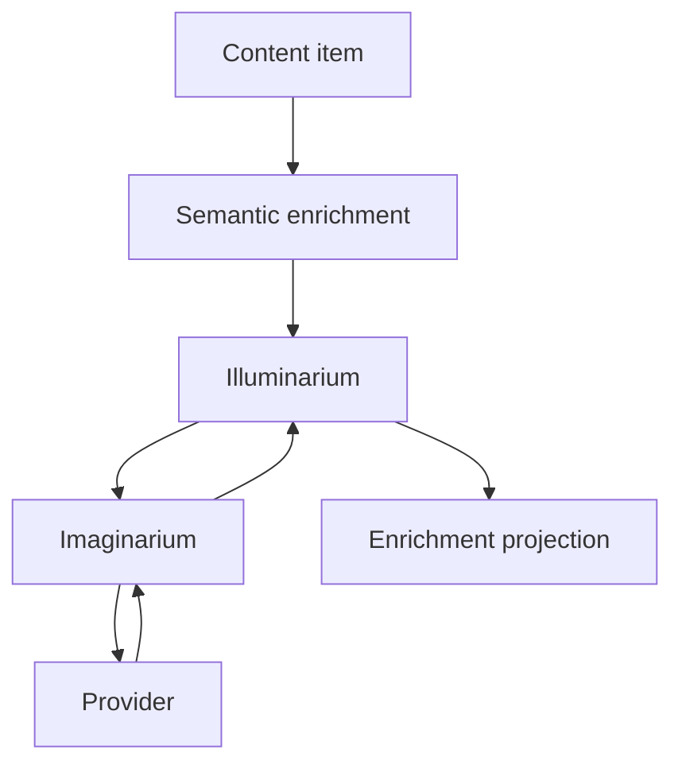

# Imaginarium Conceptual Examples

These examples use diagrams only. They are meant to explain conceptual flow, not
APIs or implementation.

## Example A: Summarize an Article

## Example B: Create a Website

## Example C: Observe a Mission

## Example D: Enrichment Without Agents

