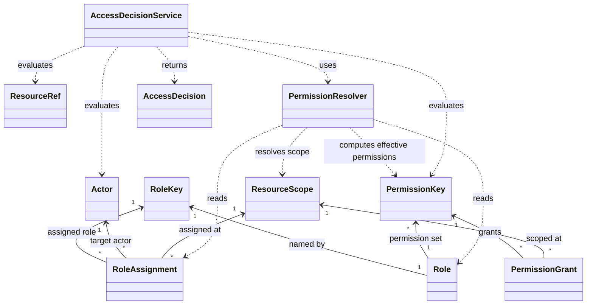
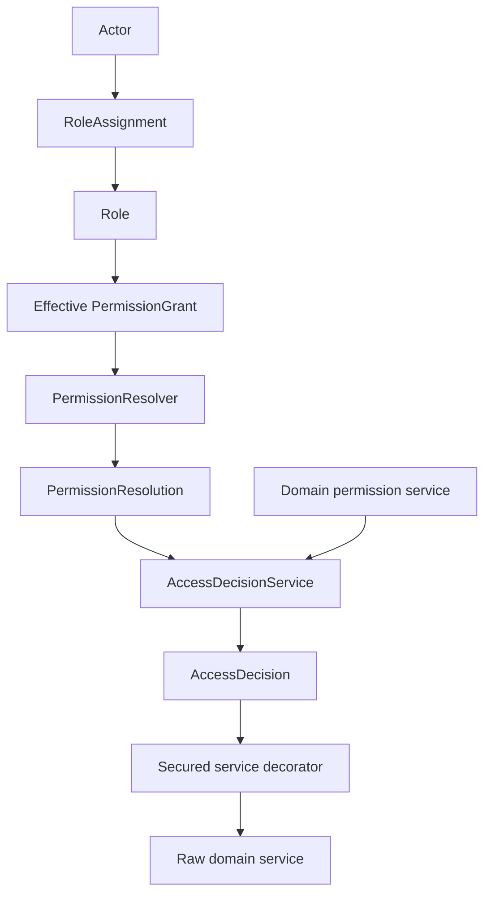

# Custos Domain Model

Custos answers one domain authorization question:

```text
May this Actor perform this PermissionKey on this ResourceRef under this Context?
```

This document is a mental model companion to ADR-009. It does not introduce implementation details beyond the approved Custos vocabulary.

## Core Mental Model

- `PermissionGrant` and `RoleAssignment` are authorization data.
- `Role` is a permission blueprint named by `RoleKey`.
- `BuiltInRoles` is a catalog of role blueprints.
- `PermissionResolver` computes effective permissions from role assignments, the role registry, scopes, and permission rules.
- `PermissionEvaluator` and `AccessDecisionService` answer whether an actor can perform a permission on a resource.
- Domain permission services translate domain operation intent into permission checks.
- Secured service decorators enforce `AccessDecision` before delegating to raw domain services.
- `AccessDecision` is the explained result: granted or denied, with the relevant actor, permission, resource, and reason.

Keep the data objects simple:

- `Role` does not contain an `Actor`.
- `Role` does not contain a `ResourceScope`.
- `RoleAssignment` connects actor + role key + scope.
- `PermissionGrant` pairs permission + scope.
- `SUPER_ADMIN` in `BuiltInRoles` includes all built-in permissions for introspection and blueprint purposes.
- `SUPER_ADMIN` bypass logic is not encoded in `BuiltInRoles`; it belongs in resolver/evaluator behavior.
- Hard invariants must run before any `SUPER_ADMIN` bypass.
- Permission implication and scope inheritance belong in resolver/evaluator behavior, not inside the data records.

## Class Diagram



## Current Authorization Flow



The domain permission service is the caller-facing authorization adapter for a domain
operation. It builds the `PermissionKey`, `ResourceRef`, and `ResourceScope` needed for the
check, then delegates to `AccessDecisionService`.

`AccessDecisionService` is implemented. The default implementation delegates scope-based
resolution to `PermissionResolver`, receives a `PermissionResolution`, and maps it to an
`AccessDecision` while preserving the original `ResourceRef` from the request.

The diagram shows an effective `PermissionGrant` because resolution combines a
`RoleAssignment` scope with permissions from the assigned `Role`. The current `Role` record
still stores `Set<PermissionKey>` directly; `PermissionGrant` itself remains a simple
`PermissionKey + ResourceScope` data object and does not carry an actor or role.

## Current Custos Status

- `PermissionResolver` API exists.
- `DefaultPermissionResolver` exists as the internal implementation.
- It computes effective permissions from `RoleAssignment` plus a `RoleKey` -> `Role` registry.
- It enforces the AGENT + SUPER_ADMIN hard invariant before bypass.
- It applies scoped `SUPER_ADMIN` bypass for valid non-agent actors.
- It walks the scope hierarchy without crossing site boundaries.
- It implements `contentItem.update` -> `contentItem.read` and `contentItem.publish` -> `contentItem.read` implications.
- `AccessDecisionService` API exists.
- `DefaultAccessDecisionService` exists as the internal implementation.
- `DefaultAccessDecisionService` delegates to `PermissionResolver`.
- `DefaultAccessDecisionService` translates `PermissionResolution` into `AccessDecision`.
- Domain permission services exist: `SitePermissionsService`, `ContentTypePermissionsService`, and `ContentItemPermissionsService`.
- Secured decorators exist: `SecuredSiteService`, `SecuredContentTypeService`, and `SecuredContentItemService`.
- `ConciliumRuntime.secured(...)` composes the secured runtime and exposes secured top-level services.
- `ConciliumRuntime.inMemory()` remains the unsecured/back-compat runtime path.
- Denied operations fail before delegation, so they do not mutate state, emit domain events, update index projections, or accidentally create Chronicon audit records.
- Direct actor `PermissionGrant` support is still pending.
- `AccessDecision` trace is still pending.
- Security audit consumers/sinks are still pending.

## Domain Permission Services

Domain permission services keep authorization checks readable at the domain-operation level:

- `SitePermissionsService`
- `ContentTypePermissionsService`
- `ContentItemPermissionsService`

They translate operation intent into:

```text
PermissionKey + ResourceRef + ResourceScope + PermissionResolutionSnapshot
```

and then delegate to `AccessDecisionService`.

They do not authenticate actors, persist permissions, expose transport concerns, mutate domain
state, or produce audit records.

## Secured Decorators

Secured decorators enforce authorization before delegating:

- `SecuredSiteService`
- `SecuredContentTypeService`
- `SecuredContentItemService`

The rule is:

```text
check permission
  -> require AccessDecision.Granted
  -> delegate only after authorization succeeds
```

If the decision is denied, `AccessDeniedException` is thrown and the raw domain service is not
called.

## Runtime Composition

`ConciliumRuntime.secured(...)` composes the current in-memory secured runtime:

```text
ConciliumRuntime.secured(...)
  -> exposes secured SiteService
  -> exposes secured ContentTypeService
  -> exposes secured ContentItemService
```

Runtime rule:

- `ConciliumRuntime.secured(...)` is the recommended path for adapter, external, and domain entrypoints.
- `ConciliumRuntime.inMemory()` remains unsecured by design for tests, low-level scenarios, and backward compatibility.
- `coreRuntime()` exposes the raw core runtime.
- External and domain entrypoints should use `runtime.siteService()`, `runtime.contentTypeService()`, and `runtime.contentItemService()`.
- External and domain entrypoints should not use `runtime.coreRuntime().siteService()`, `runtime.coreRuntime().contentTypeService()`, or `runtime.coreRuntime().contentItemService()` because those are raw services.

## Authorization Audit Direction

CODEX-018 separates authorization facts from domain audit:

- denied authorization attempts are security facts, not domain facts
- Chronicon's domain audit stream should remain focused on applied business/domain facts
- a future Chronicon-like security audit stream may exist, but it should remain meaningfully separate from domain audit
- Observance may receive PI-safe aggregate authorization metrics
- logs remain diagnostic and are not the durable audit source of truth
- `AccessDecision` may become a future source of authorization decision records/events
- future decision consumers/sinks may include security audit, Observance metrics, diagnostic logs, alerting, or no-op consumers

Custos should not directly depend on Chronicon, Observance, logging sinks, or security audit
storage.

## Accepted Gaps

- Collection read filtering is pending.
- Alias-to-`SiteKey` authorization is pending.
- Restore/delete/unarchive/purge permission vocabulary is pending.
- Direct actor grants are pending.
- `AccessDecision` trace is pending.
- Security audit consumers/sinks are pending.

## Example: Juan as Copywriter

Given:

- Juan has `COPYWRITER` on `SiteScope(site-a)`.
- `Role(COPYWRITER)` includes `contentItem.update`.
- `contentItem.update` implies `contentItem.read`.

Then:

- Juan can update `ContentItemResourceRef(site-a, page, home-page)` if the resolver finds `contentItem.update` effective for that resource.
- Juan can read `home-page` because `contentItem.update` implies `contentItem.read`.
- Juan cannot publish `home-page` if `COPYWRITER` lacks `contentItem.publish` and Juan has no other effective grant for that permission.

The implication from `contentItem.update` to `contentItem.read` is resolver/evaluator behavior. It is not stored inside `Role`, `PermissionGrant`, or `RoleAssignment`.

Direct actor-specific permission grants are not part of the current model. If needed later, they should be modeled separately, for example as a future `ActorPermissionGrant` or `DirectPermissionAssignment`.

## Olorin Plan Example

Olorin may help prepare a permission change, but it must not execute privileged permission changes by its own authority.

Example proposal:

```text
requestedBy: AgentActor("olorin")
proposal:
  assign RoleKey("COPYWRITER") to Actor("juan") at SiteScope("site-a")
  add PermissionKey("contentItem.update") to RoleKey("COPYWRITER")
```

Execution remains human-approved:

```text
approvedBy: UserActor("jsanca")
executedAs: UserActor("jsanca")
```

The proposal must still be validated by Custos before execution. Olorin is a proposer, not a security authority.
