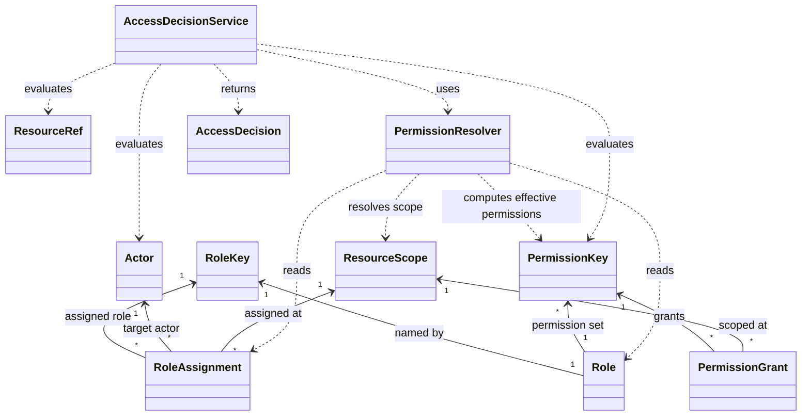
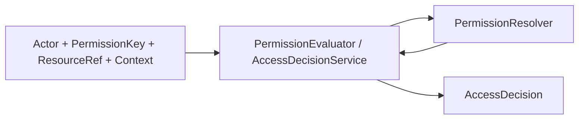

# Custos Domain Model

Custos answers one domain authorization question:

```text
May this Actor perform this PermissionKey on this ResourceRef under this Context?
```

This document is a mental model companion to ADR-009. It does not introduce implementation details beyond the approved Custos vocabulary.

## Core Mental Model

- `PermissionGrant` and `RoleAssignment` are authorization data.
- `Role` is a permission blueprint named by `RoleKey`.
- `BuiltInRoles` is a catalog of role blueprints.
- `PermissionResolver` computes effective permissions from role assignments, the role registry, scopes, and permission rules.
- `PermissionEvaluator` and `AccessDecisionService` answer whether an actor can perform a permission on a resource.
- `AccessDecision` is the explained result: granted or denied, with the relevant actor, permission, resource, and reason.

Keep the data objects simple:

- `Role` does not contain an `Actor`.
- `Role` does not contain a `ResourceScope`.
- `RoleAssignment` connects actor + role key + scope.
- `PermissionGrant` pairs permission + scope.
- `SUPER_ADMIN` in `BuiltInRoles` includes all built-in permissions for introspection and blueprint purposes.
- `SUPER_ADMIN` bypass logic is not encoded in `BuiltInRoles`; it belongs in resolver/evaluator behavior.
- Hard invariants must run before any `SUPER_ADMIN` bypass.
- Permission implication and scope inheritance belong in resolver/evaluator behavior, not inside the data records.

## Class Diagram



## Authorization Flow



The evaluator/service is the caller-facing authorization API. The resolver is the policy computation layer that determines effective permissions. `AccessDecisionService` wiring over the resolver is still pending, so the resolver does not produce `AccessDecision` yet.

## Current Resolver Status

- `PermissionResolver` API exists.
- `DefaultPermissionResolver` exists as the internal implementation.
- It computes effective permissions from `RoleAssignment` plus a `RoleKey` -> `Role` registry.
- It enforces the AGENT + SUPER_ADMIN hard invariant before bypass.
- It applies scoped `SUPER_ADMIN` bypass for valid non-agent actors.
- It walks the scope hierarchy without crossing site boundaries.
- It implements `contentItem.update` -> `contentItem.read` and `contentItem.publish` -> `contentItem.read` implications.
- It does not produce `AccessDecision` yet.
- Direct actor `PermissionGrant` support is still pending.
- Explanation trace is still pending.

## Example: Juan as Copywriter

Given:

- Juan has `COPYWRITER` on `SiteScope(site-a)`.
- `Role(COPYWRITER)` includes `contentItem.update`.
- `contentItem.update` implies `contentItem.read`.

Then:

- Juan can update `ContentItemResourceRef(site-a, page, home-page)` if the resolver finds `contentItem.update` effective for that resource.
- Juan can read `home-page` because `contentItem.update` implies `contentItem.read`.
- Juan cannot publish `home-page` if `COPYWRITER` lacks `contentItem.publish` and Juan has no other effective grant for that permission.

The implication from `contentItem.update` to `contentItem.read` is resolver/evaluator behavior. It is not stored inside `Role`, `PermissionGrant`, or `RoleAssignment`.

Direct actor-specific permission grants are not part of the current model. If needed later, they should be modeled separately, for example as a future `ActorPermissionGrant` or `DirectPermissionAssignment`.

## Olorin Plan Example

Olorin may help prepare a permission change, but it must not execute privileged permission changes by its own authority.

Example proposal:

```text
requestedBy: AgentActor("olorin")
proposal:
  assign RoleKey("COPYWRITER") to Actor("juan") at SiteScope("site-a")
  add PermissionKey("contentItem.update") to RoleKey("COPYWRITER")
```

Execution remains human-approved:

```text
approvedBy: UserActor("jsanca")
executedAs: UserActor("jsanca")
```

The proposal must still be validated by Custos before execution. Olorin is a proposer, not a security authority.
